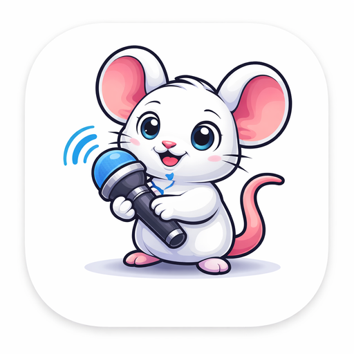

<p align="center">
  
</p>

# Mouthpiece

An open-source desktop dictation workstation for macOS, Windows, and Linux.  
Mouthpiece turns “press a hotkey, speak, and get text back into the app you are using” into a full desktop workflow: recording capsule, transcription engines, dictionary, optional AI post-processing, history, permission guidance, control panel, and app updates all live in one product.

中文 README: [README.md](README.md)

## Credits and Origins

Mouthpiece continues to evolve from [OpenWhispr](https://github.com/OpenWhispr/openwhispr) and [VoiceInk](https://github.com/le-soleil-se-couche/VoiceInk).  
Thanks to both upstream projects for the inspiration and foundation. This README reflects the current Mouthpiece codebase and product behavior rather than historical upstream behavior.

## What It Is

Mouthpiece is built for people who want speech input to fit naturally into everyday desktop work, especially if you:

- dictate into many different apps during the day
- want to choose between local and cloud transcription
- need dictionaries, terminology, and auto-learning for proper nouns
- want optional AI cleanup, rewriting, or formatting after transcription
- expect history, clipboard fallback, and reliable desktop integration

The default model is BYOK.  
You can use local models, or bring your own API key for cloud providers. Account login exists as an optional capability, but it is not required for the core workflow.

## What Mouthpiece Can Do Today

- Start dictation from a global hotkey, with tap/hold behavior matched to platform support
- Show a floating recording capsule with state, audio feedback, and live text
- Switch between local transcription and cloud transcription depending on privacy, latency, and cost needs
- Improve results with dictionaries, terminology, auto-learned corrections, and post-processing normalization
- Run optional AI post-processing through Prompt Studio for cleanup, rewriting, and formatting
- Insert text back into the current app automatically, with clipboard fallback when direct insertion is not safe or available
- Save transcription history for review, copy, and reuse
- Guide users through permissions, tray behavior, control panel setup, and packaged-app updates

## Get Started in Three Minutes

### 1. Install or run it

- Packaged app users: download the right build from [GitHub Releases](https://github.com/NotWizard/Mouthpiece/releases)
- Source users: see “Run from source” below

### 2. Go through onboarding

The current onboarding flow has 4 steps:

1. `Welcome`
2. `Permissions`
3. `Hotkey Setup`
4. `Activation`

This is where you set permissions, pick a hotkey, and test dictation for the first time.

### 3. Grant permissions

There are two important permission buckets:

- microphone access, for recording
- accessibility access, for automatic insertion into other apps

If you skip accessibility for now, Mouthpiece still works, but it will rely more often on clipboard fallback instead of direct insertion.

### 4. Pick your transcription mode

- Choose local transcription if you want more privacy and on-device control
- Choose cloud transcription if you want hosted providers or provider-specific realtime options

Then decide whether you want optional AI post-processing on top.

### 5. Start dictating

- Press your hotkey
- Watch the floating capsule for recording state and live text
- Stop dictation and let Mouthpiece insert the result, or recover it from history / clipboard fallback

## Modes and Capabilities

### Transcription modes

| Mode | Best for | Current support |
| --- | --- | --- |
| Local transcription | Privacy, offline workflows, on-device control | OpenAI Whisper, NVIDIA Parakeet, Qwen ASR MLX |
| Cloud transcription | Hosted providers, provider choice, some realtime paths | OpenAI, Groq, Deepgram, Mistral, Soniox, Alibaba Bailian |

### Local transcription

- **OpenAI Whisper**: the classic local option, with the broadest model lineup
- **NVIDIA Parakeet**: a sherpa-onnx based local pipeline
- **Qwen ASR MLX**: a Qwen ASR path oriented toward Apple Silicon local use

### Cloud transcription

- **OpenAI**
- **Groq**
- **Deepgram**
- **Mistral**
- **Soniox**
- **Alibaba Bailian**

Some providers offer explicit realtime vs non-realtime switching in the app, depending on the provider and the selected settings.

### Optional intelligence layer

The intelligence layer is optional. It is not required for dictation to work.

You can route transcribed text into local or cloud reasoning models for:

- cleanup
- formatting
- light rewriting
- structured output
- reusable Prompt Studio workflows

Current reasoning coverage includes:

- Cloud: OpenAI, Anthropic, Google Gemini, Groq, Alibaba Bailian
- Local: Qwen, Mistral, Meta Llama, OpenAI OSS, Gemma

### Dictionary, terminology, and auto-learning

The dictionary system is more than a manual word list:

- custom dictionary support
- terminology management
- auto-learning from user corrections
- dictionary-based post-processing normalization

This is especially useful for names, product terms, internal jargon, and mixed Chinese/English dictation.

### Insertion and fallback behavior

Mouthpiece is designed to do more than return text. It tries to get text back into the app you are actively using.

- It prefers automatic insertion when the environment allows it
- It falls back to the clipboard when direct insertion is not suitable
- When fallback happens, the app makes it explicit that the result is already copied and can be pasted manually with `Cmd+V` / `Ctrl+V`

That makes it practical across browsers, editors, chat apps, document tools, and mixed desktop workflows.

### History and control panel

The current control panel navigation includes:

- Home
- Dictionary
- General
- Hotkeys
- Transcription
- Intelligence
- Privacy & Data
- System

This is where users manage history, dictionaries, providers, hotkeys, permissions, updates, and system-level behavior.

## Permissions, Privacy, and Boundaries

### Permissions

- **Microphone access**: required for recording
- **Accessibility access**: required for automatic insertion into other apps
- Some platforms may also need extra system setup or paste-tool support for the best experience

### Privacy

- Local transcription keeps audio on the device
- Cloud transcription and cloud reasoning route data through the provider you choose
- BYOK is the default model, so quotas and billing stay with your own provider account

### Product boundaries

- Account login is optional, not the default requirement
- AI post-processing is optional, not required for successful dictation
- Speech recognition and post-processing can both make mistakes; always review high-risk content manually

## Further Reading

| Document | When to open it |
| --- | --- |
| [LOCAL_WHISPER_SETUP.md](LOCAL_WHISPER_SETUP.md) | If you want full detail on local Whisper models, caching, and runtime behavior |
| [TROUBLESHOOTING.md](TROUBLESHOOTING.md) | If you are debugging general cross-platform issues |
| [WINDOWS_TROUBLESHOOTING.md](WINDOWS_TROUBLESHOOTING.md) | If you are debugging Windows-specific issues |
| [docs/macos-local-codesign.md](docs/macos-local-codesign.md) | If you need local macOS signing or more stable Accessibility permission behavior |

## Run from Source

### Development

```bash
git clone https://github.com/NotWizard/Mouthpiece.git
cd Mouthpiece
npm install
npm run dev
```

### Common commands

```bash
# Type checking
npm run typecheck

# Lint
npm run lint

# Renderer build
npm run build:renderer

# Platform builds
npm run build:mac
npm run build:win
npm run build:linux
```

If you just want to use the app, the packaged builds from Releases are the recommended path.

## Upstream

- [OpenWhispr](https://github.com/OpenWhispr/openwhispr)
- [VoiceInk](https://github.com/le-soleil-se-couche/VoiceInk)

## License

MIT. See [LICENSE](LICENSE).
