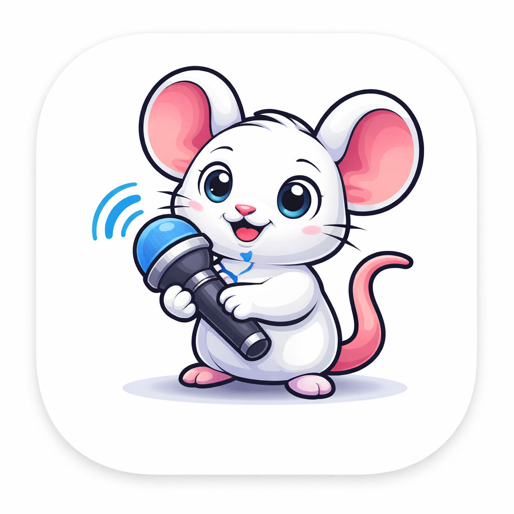
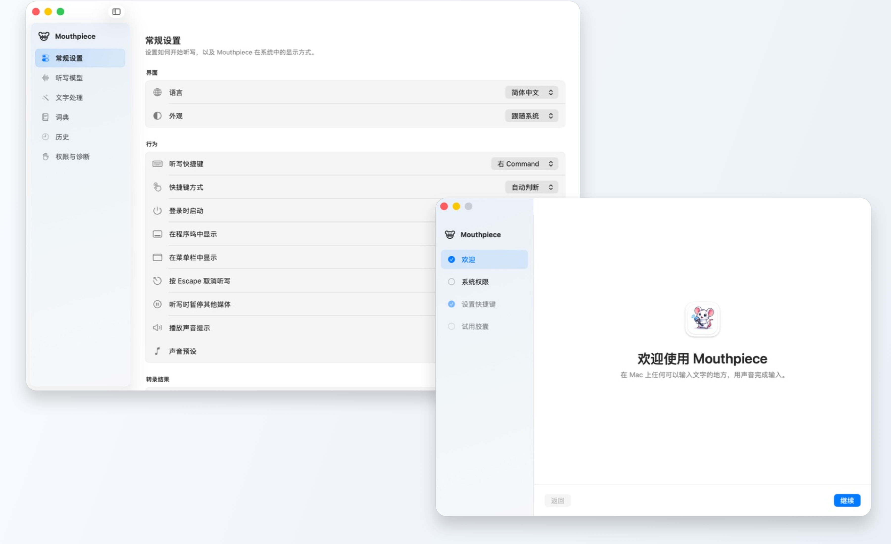

<div align="center">
  

  <h1>Mouthpiece</h1>

  <p>
    A native macOS dictation app.<br />
    Press a hotkey, speak, and your words appear in the app you are using.
  </p>

  <p>
    <a href="https://github.com/NotWizard/Mouthpiece/releases/latest">
      
    </a>
    <a href="https://github.com/NotWizard/Mouthpiece/actions/workflows/ci.yml">
      
    </a>
    
    
    <a href="LICENSE">
      
    </a>
  </p>

  <p>
    <a href="https://github.com/NotWizard/Mouthpiece/releases/latest"><strong>Download the latest release</strong></a>
    ·
    <a href="#quick-start">Quick Start</a>
    ·
    <a href="README.md">简体中文</a>
  </p>
</div>

<p align="center">
  
</p>

## What is Mouthpiece?

Mouthpiece is a dictation app designed specifically for macOS. Whether you are writing an email, chatting, taking notes, or editing a document, use a global hotkey to start speaking. Mouthpiece transcribes your voice, optionally cleans up or translates the result, and inserts it into the active app.

The app is built with Swift, SwiftUI, AppKit, and AVFoundation. It contains no Electron, Chromium, React, or Node.js runtime. Speech recognition can run locally on your Mac or through a cloud provider of your choice.

## Features

- **Dictate anywhere**: Record with a global hotkey and insert the result into any macOS app that accepts text input.
- **Native macOS experience**: Native windows, menu bar integration, hotkeys, audio capture, and text insertion with virtually no idle CPU or GPU usage.
- **Local or cloud transcription**: Use local Whisper, Parakeet, or Qwen ASR models, or connect Bailian, Volcengine, OpenAI, Deepgram, Soniox, AssemblyAI, Groq, Mistral, and compatible services.
- **Live dictation capsule**: See recording state, audio level, live text, and errors across displays, Spaces, and full-screen apps.
- **Cleanup and translation**: Use a separate translation shortcut, custom prompts, a personal dictionary, and multiple text-processing providers.
- **Complete dictation controls**: Hold-to-talk, toggle and automatic activation, Escape cancellation, automatic paste, clipboard retention, and media pause and resume.

## Installation

### Requirements

- macOS 15 Sequoia or macOS 26 Tahoe
- Apple Silicon or Intel Mac
- Microphone permission
- Accessibility permission for global hotkeys and automatic text insertion

Starting with Mouthpiece 2.0, only macOS is supported. Windows, Linux, and macOS 14 or earlier are no longer maintained.

### Download

1. Open [GitHub Releases](https://github.com/NotWizard/Mouthpiece/releases/latest).
2. Download the DMG matching your Mac architecture.
3. Open the DMG and drag `Mouthpiece.app` into the Applications folder.
4. Follow the onboarding flow to grant Microphone and Accessibility permissions.

> [!NOTE]
> Mouthpiece uses a stable self-signed macOS identity and is not currently notarized by Apple. After installing from a DMG, macOS may require you to right-click the app and choose Open, or approve it in System Settings under Privacy & Security.

### Install with Homebrew

You can also install directly with Homebrew:

```bash
brew install --cask NotWizard/mouthpiece/mouthpiece
```

### Automatic updates

Once installed, there is no need to update manually: new versions are offered and installed through the app's built-in updater (Sparkle). The manual approval above is only needed on first install.

## Quick Start

1. Install and open Mouthpiece.
2. Grant Microphone and Accessibility permissions during onboarding.
3. Choose local transcription or configure a cloud transcription provider.
4. Configure your dictation hotkey and activation behavior.
5. Focus any text field, press the hotkey, speak, and stop recording.
6. Mouthpiece transcribes your speech and, depending on your settings, cleans up, copies, or inserts the result.

## License

Mouthpiece is open source under the [MIT License](LICENSE).
