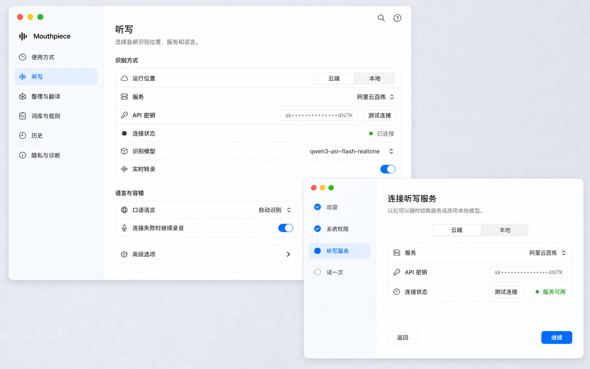

# Mouthpiece macOS 26 控制面板与 Onboarding 完整重构方案

## 1. 文档信息

- 状态：可作为实施基线
- 日期：2026-07-14
- 目标平台：macOS 15 Sequoia 与 macOS 26 Tahoe
- 实现技术：SwiftUI 为主，必要的窗口能力继续使用 AppKit
- 设计范围：控制面板、Onboarding、相关导航、状态反馈与设置交互
- 关联技术方案：[Swift 原生重写完整实施方案](./2026-07-13-swift-native-rewrite-plan.md)
- 视觉参考：[macOS 26 控制面板与 Onboarding Demo](../assets/macos26-control-panel-onboarding-demo.png)

本文件只定义原生应用的 UI、UX、信息架构和实施边界。音频、快捷键、转录状态机、Provider 协议、文本插入、数据迁移、签名和发布继续以 Swift 原生重写方案为准。

## 2. 重构目标

本次重构要解决以下问题：

1. 将技术化、含义模糊的导航名称改成用户可以直接理解的任务名称。
2. 合并不需要单独成页的功能，减少导航层级和重复说明。
3. 统一字号、间距、行高、颜色、图标、状态和辅助文案规则。
4. 去除过多、过重和相互嵌套的卡片，让页面恢复清晰的信息层级。
5. 使用原生 SwiftUI 控件和 macOS 26 的系统设计语言，而不是手工模仿 macOS。
6. 让 Onboarding 与控制面板共享同一套视觉语言、组件和状态反馈。
7. 保留当前所有设置、Provider、本地模型、历史、术语、Prompt Studio、权限和诊断能力。
8. 确保控制面板隐藏后没有持续动画、计时器或无意义的 GPU 活动。

### 2.1 成功结果

- 用户可以在 10 秒内判断每个一级导航的用途。
- 常用设置在页面首屏可见，高级设置按需展开。
- 同类控件拥有一致的排版和反馈，不再出现辅助文案比标题更醒目的情况。
- 控制面板和 Onboarding 在浅色、深色、高对比度、降低透明度与减少动态效果模式下均可用。
- macOS 26 使用系统提供的 Liquid Glass 表现；macOS 15 使用原生兼容外观，不制作一套仿制 Glass。
- UI 重构不改变已有设置键、用户数据和听写行为。

## 3. 非目标

以下内容不属于本次 UI 重构：

- 不重做录音胶囊的视觉样式和窗口行为。
- 不修改音频采样、VAD、实时转录、批量回退和文本插入逻辑。
- 不增删 Provider、本地模型或推理能力。
- 不改变设置存储、Keychain、历史数据库或迁移格式。
- 不加入账号、订阅、云同步、模板市场或其他新产品模块。
- 不引入第三方 UI 框架、设计系统依赖或快照测试依赖。

Onboarding 的“试一次”步骤可以显示真实胶囊并调用现有听写流程，但不会借此修改胶囊本身。

## 4. 当前实现基线

当前原生控制面板已经具备完整功能，但大部分页面和共享组件集中在 `Native/Sources/Features/ControlPanel/ControlPanelView.swift`。Onboarding 位于 `Native/Sources/Features/Onboarding/OnboardingView.swift`，使用四个线性步骤。

| 当前区域 | 当前内容 | 主要问题 |
| --- | --- | --- |
| 通用 | 语言、外观、快捷键、启动、Dock、菜单栏、声音、麦克风、权限 | 内容合理，但“通用”无法描述用户任务，单行内容密度不一致 |
| 语音识别 | 云端/本地、Provider、模型、密钥、实时、语言、回退 | “语音识别”偏技术；多个 Provider 的分段控件拥挤；条件设置层级不清 |
| 文本处理 | 文字整理、AI 服务、本地推理、翻译 | 名称宽泛；文字整理与翻译之间的主从关系不明确 |
| 个性化 | 偏好术语、避免术语、替换规则、Prompt Studio | 一个页面承担四种不同编辑任务，Prompt Studio 视觉重量过大 |
| 历史记录 | 记录数量、复制、删除、原始转录 | 缺少面向大量记录的搜索和主从浏览结构 |
| 隐私与高级 | 敏感应用、云端处理、诊断、更新、关于 | “高级”成为杂项入口，安全、诊断与版本层级混在一起 |
| Onboarding | 欢迎、麦克风、辅助功能、Provider | 权限被拆成两个空旷页面；只完成配置，没有验证听写是否真正可用 |

## 5. 设计原则

### 5.1 原生优先

优先使用 `NavigationSplitView`、`List`、`Form` 语义、`Picker`、`Toggle`、`Menu`、`DisclosureGroup`、`Toolbar`、`Sheet`、`Popover` 和系统颜色。只有系统组件无法表达既有功能时才创建轻量自定义组件。

### 5.2 内容层稳定，控制层通透

Liquid Glass 只用于导航、工具栏、菜单、Popover、Sheet 和少量浮层控件。设置正文、表格、编辑器和历史内容使用稳定实体背景。不能把每个设置分组都做成透明玻璃卡片。

### 5.3 紧凑但不拥挤

紧凑来自更窄的侧栏、更小的页面边距、统一行高和减少说明文字，而不是缩小可点击区域。普通设置行保持 44 pt，高信息量设置行保持 54 至 56 pt。

### 5.4 渐进披露

默认只展示完成主要任务所需的设置。自定义地址、超时、回退策略和模型细节放入“高级选项”或按条件出现。隐藏设置不能改变原有值。

### 5.5 状态就地反馈

保存、连接、下载、授权和错误状态在对应控件附近显示。除应用无法继续启动外，不使用全局阻断式警告框。

### 5.6 语义色而非固定主题

SwiftUI 实现使用系统语义色和材质。文档中的十六进制颜色仅供设计稿和视觉验收参考，不作为代码中的固定色值。

### 5.7 冷调轻玻璃

视觉方向采用浅色、通透、低饱和的冷调体系。侧栏可以在系统 Glass 上承接极淡的冰蓝与青色环境染色，正文仍保持近白实体表面。颜色用于增加材质深度，不把整个窗口染成蓝色，也不通过加重灰底制造层级。

## 6. 新的信息架构

### 6.1 一级导航

| 新导航 | 替代当前区域 | 用户心智 | SF Symbol 建议 |
| --- | --- | --- | --- |
| 使用方式 | 通用 | 如何启动、触发和听到 Mouthpiece | `switch.2` |
| 听写 | 语音识别 | 声音在哪里、由谁识别 | `waveform` |
| 整理与翻译 | 文本处理 | 转录完成后如何处理文字 | `wand.and.stars` |
| 词库与规则 | 个性化 | Mouthpiece 应该记住哪些词和规则 | `text.book.closed` |
| 历史 | 历史记录 | 查找和复用以前的听写 | `clock` |
| 隐私与诊断 | 隐私与高级 | 数据、敏感应用、日志和更新 | `hand.raised` |

导航顺序按使用频率和任务流程排列，不把快捷键单独设为一级页面。

### 6.2 页面标题与副标题

| 页面 | 标题 | 副标题 |
| --- | --- | --- |
| 使用方式 | 使用方式 | 设置如何开始听写，以及 Mouthpiece 在系统中的显示方式。 |
| 听写 | 听写 | 选择音频识别位置、服务和语言。 |
| 整理与翻译 | 整理与翻译 | 控制转录完成后的文字整理和翻译。 |
| 词库与规则 | 词库与规则 | 管理术语、替换规则和自定义指令。 |
| 历史 | 历史 | 查找、复制和管理以前的听写。 |
| 隐私与诊断 | 隐私与诊断 | 管理敏感应用、日志、更新和应用数据。 |

## 7. 窗口与整体布局

### 7.1 控制面板窗口

| 项目 | 规格 |
| --- | --- |
| 默认尺寸 | 1040 × 700 pt |
| 最小尺寸 | 920 × 640 pt |
| 推荐最大内容宽度 | 普通设置页 760 pt；历史页可填满详情区域 |
| 侧栏宽度 | 最小 188 pt，理想 196 pt，最大 204 pt |
| 正文水平边距 | 28 pt |
| 正文垂直边距 | 顶部 24 pt，底部 28 pt |
| 页面标题区 | 标题与副标题间距 4 pt，标题区与首分组间距 22 pt |
| 窗口行为 | 可调整大小；恢复上次尺寸、位置和最后选中页面 |

侧栏使用系统 `.sidebar` 列表样式。窗口变窄时允许用户折叠侧栏，但不能把六个页面压缩成不可识别的图标栏。

### 7.2 侧栏

- 顶部显示 Mouthpiece 名称和单色应用图标，不增加版本、口号或营销文字。
- 导航行高度 32 至 34 pt，图标 16 pt，文字使用系统 Body。
- macOS 26 使用系统 sidebar Liquid Glass，并叠加极淡的冰蓝与青色环境染色；整体色彩强度控制在 3% 至 5%。
- 染色从左上或顶部的轻微冷蓝逐渐回到近中性透明，视觉上应像桌面环境反射，而不是一条可辨认的渐变色带。
- 选中状态使用更轻的半透明系统蓝背景，蓝色重点落在图标和文字上。
- Hover 只增加约 3% 至 4% 的冷白高光，不改变尺寸、文字粗细或材质厚度。
- 底部不放关键操作。可以显示一行非关键状态，例如“可开始听写”或“需要配置服务”。
- 导航选择保存为 UI 偏好；不加入 `AppSettings` 业务模型。

### 7.3 正文区域

- 普通页面使用单列滚动结构，内容左对齐，不在大窗口中无限拉宽。
- 每个逻辑分组有一个分组标题和一个连续表面，表面内用系统分隔线区分设置行。
- 浅色模式下，正文窗口使用冷调近白背景，设置分组只与窗口背景形成约 2% 至 3% 的明度差。
- 页面分组不悬浮，不使用阴影，不在分组内部再放卡片。
- 只有历史页和 Prompt Studio 可以使用主从布局，因为它们需要同时浏览列表与详情。

### 7.4 工具栏

- 设置窗口默认不放全局搜索；六个明确导航与渐进披露足以覆盖首轮重构。
- 历史页在自己的工具栏提供搜索与日期过滤。
- Prompt Studio 在专注编辑窗口提供恢复默认、测试和保存动作。
- 工具栏图标使用 SF Symbols，并提供 Tooltip 与 VoiceOver Label。
- macOS 26 使用系统工具栏 Liquid Glass；不对工具栏背景手工叠加 Material。

如果可用性测试显示用户寻找设置平均超过 10 秒，再增加全局设置搜索；首轮不为尚未验证的问题建立搜索索引。

## 8. 视觉设计系统

### 8.1 字体层级

| 用途 | SwiftUI 样式 | 参考尺寸与字重 |
| --- | --- | --- |
| 页面标题 | `.title2.weight(.semibold)` | 20 pt Semibold |
| 页面副标题 | `.callout` | 13 pt Regular |
| 分组标题 | `.subheadline.weight(.semibold)` | 13 pt Semibold |
| 设置名称 | `.body` | 13 pt Regular |
| 设置值 | `.body` | 13 pt Regular 或 Medium |
| 辅助说明 | `.caption` | 11 至 12 pt Regular |
| 状态文字 | `.caption` | 11 至 12 pt Medium |
| 模型 ID、路径 | `.system(.body, design: .monospaced)` | 12 至 13 pt |

中文使用系统 PingFang SC/TC 回退，不内置第三方字体，不通过窗口宽度动态缩放字号。

### 8.2 间距 Token

| Token | 数值 | 用途 |
| --- | --- | --- |
| `space1` | 4 pt | 标题与副标题、图标内部间距 |
| `space2` | 8 pt | 分组标题与表面、紧凑控件间距 |
| `space3` | 12 pt | 设置行内部间距 |
| `space4` | 16 pt | 相关控件组、Sheet 内部间距 |
| `space5` | 24 pt | 页面主要分组间距 |
| `space6` | 32 pt | 大区块或 Onboarding 内容间距 |

禁止在单个页面内随意出现 10、14、18、20、30 等新的间距值。窗口边距与固定尺寸除外。

### 8.3 尺寸与圆角

| 元素 | 规格 |
| --- | --- |
| 普通设置行 | 44 pt 最小高度 |
| 带辅助说明的设置行 | 54 至 56 pt |
| 图标列 | 20 pt 固定宽度 |
| 行内图标 | 15 至 16 pt |
| 分组圆角 | 8 pt |
| 自定义输入框圆角 | 6 pt，优先使用系统默认 |
| 图标按钮 | 28 × 28 pt 或系统默认 |
| 主按钮 | 系统 `.borderedProminent`，不手工制作胶囊 |

只有 Toggle、Segmented Picker、进度胶囊等原生控件保留系统胶囊形态。普通按钮、标签和导航项不能全部变成圆形胶囊。

### 8.4 颜色体系

| 语义 | SwiftUI/AppKit 来源 | 浅色参考 | 深色参考 |
| --- | --- | --- | --- |
| 窗口背景 | `windowBackgroundColor` | 冷调近白，参考 `#F8F9FB` | `#1C1C1E` |
| 内容表面 | `controlBackgroundColor` | 近白，参考 `#FFFFFF` | `#2A2A2D` |
| 侧栏基础 | 系统 sidebar material | 系统自适应 Glass | 系统自适应 Glass |
| 侧栏冷蓝染色 | 强调色低透明度叠层 | 蓝 3% 至 4%，青 1% 至 2% | 蓝 5% 至 7%，青 2% 至 3% |
| 主文字 | `labelColor` | `#1D1D1F` | `#F5F5F7` |
| 次文字 | `secondaryLabelColor` | `#6E6E73` | `#AEAEB2` |
| 三级文字 | `tertiaryLabelColor` | 系统自适应 | 系统自适应 |
| 分隔线 | `separatorColor` | 黑色约 7% 至 9% | 白色约 12% 至 14% |
| 强调色 | `Color.accentColor` | 系统蓝参考 `#007AFF` | 系统蓝参考 `#0A84FF` |
| 成功 | `systemGreen` | `#34C759` | `#30D158` |
| 警告 | `systemOrange` | `#FF9500` | `#FF9F0A` |
| 错误/破坏 | `systemRed` | `#FF3B30` | `#FF453A` |

视觉关系规则：

- 正文分组与窗口背景的明度差控制在浅色 2% 至 3%、深色 4% 至 6%。
- 侧栏冷色染色必须低于选中背景，且不能降低主文字对比度。
- 冰蓝与青色只出现在侧栏、步骤栏和系统允许的控制层，不进入正文分组。
- 染色实现优先依赖系统材质与低透明度语义色叠层，不使用固定大面积位图背景。

交互叠色规则：

- Hover：侧栏使用冷白 3% 至 4%；正文行使用主文字色 4% 至 5%。
- Pressed：主文字色 10% 至 12% 透明度。
- Selected：强调色在浅色模式约 10% 至 12%，深色模式约 18% 至 22%。
- Focus：系统 `keyboardFocusIndicatorColor`，2 pt 可见焦点环。
- Disabled：使用系统禁用外观，不手工把所有内容统一降到固定透明度。

颜色不能单独承载状态。成功、警告与错误必须同时包含图标或文字。

### 8.5 材质、边框与阴影

- 侧栏、Onboarding 步骤栏、工具栏、菜单和 Popover 使用系统语义材质。
- 侧栏和步骤栏允许叠加低透明度冷蓝/青色 Tint；Tint 不得替代系统材质，也不得形成明显色带。
- 侧栏内缘可以保留一条由系统材质产生的轻微高光；不手工绘制高亮描边框住整个侧栏。
- 正文分组使用近白实体 `controlBackgroundColor`，不使用 `.ultraThinMaterial`，也不使用中灰底色。
- 分组之间依靠留白，分组内部依靠系统分隔线。
- 内容分组不加阴影。窗口阴影交给 AppKit。
- 自定义临时浮层确实需要阴影时，参考 `0 8 24`、黑色 16% 至 20%，全应用只保留这一档。
- 不使用彩色外发光、渐变描边、磨砂玻璃内容卡、装饰性模糊光斑或覆盖整个正文的彩色渐变。

### 8.6 图标

- 全部使用 SF Symbols，默认单色或系统层级渲染。
- 一级导航图标来自同一视觉重量，不能混用填充、轮廓和彩色图标。
- 行内图标用于快速识别设置类别，不为每个文字说明增加图标。
- 语言选项使用“语言名称 + 地区文本”或 `globe` 图标，不使用国旗表示语言，避免繁体中文旗帜错误和地区歧义。

### 8.7 动效

- Hover 与 Pressed：80 至 120 ms。
- 条件设置展开与收起：160 至 220 ms，使用透明度和高度变化。
- 页面切换：使用系统导航过渡，不添加横向滑动或缩放。
- 成功状态：一次淡入，不循环闪烁。
- 模型下载：使用系统 `ProgressView`，不制作持续发光动画。
- 开启 Reduce Motion 后取消位移与缩放，只保留必要淡入淡出。

## 9. 共用组件规范

### 9.1 `SettingsPage`

负责页面滚动、最大宽度、标题、副标题和分组间距。它不持有业务状态，也不决定具体设置内容。

### 9.2 `SettingsSection`

包含分组标题、可选尾部说明和一个连续内容表面。不能在内部嵌套另一个 `SettingsSection`。

### 9.3 `SettingsRow`

结构固定为：图标列、标题/可选说明、弹性空间、值或控件、可选状态。长模型名和路径可换行或截断并提供 Tooltip，不能挤压标题。

### 9.4 `InlineStatus`

统一表达 `idle`、`loading`、`success`、`warning` 和 `error`。状态变化不能改变整行高度。

### 9.5 `PermissionRow`

显示权限名称、用途、当前状态和“授权”或“打开系统设置”动作。系统拒绝后不能反复弹出权限请求。

### 9.6 `CredentialEditor`

- API Key 使用 `SecureField`。
- 输入是本地草稿，不在每个键入字符时写入 Keychain。
- 用户点击“保存”后写入 Keychain并显示“已保存”。
- Provider 存在无计费的验证接口时提供“测试连接”。
- Provider 不支持安全的空请求验证时显示“首次听写时验证”，不能为了测试而偷偷发送可计费的转录请求。
- 保存失败和验证失败在编辑器下方就地显示，不能清空用户输入。

## 10. 控制面板页面规格

### 10.1 使用方式

#### 界面

| 设置 | 控件 | 行为 |
| --- | --- | --- |
| 语言 | Menu Picker | 立即保存并刷新本地化；显示简体中文、繁体中文和 English 文本，不显示国旗 |
| 外观 | Menu Picker | 跟随系统、浅色、深色；立即保存 |

#### 听写行为

| 设置 | 控件 | 行为 |
| --- | --- | --- |
| 听写快捷键 | 快捷键录制控件 | 点击后进入捕获状态；Escape 取消；完成后恢复全局监听 |
| 快捷键方式 | Menu Picker | 点击切换、按住说话、自动判断 |
| 登录时启动 | Toggle | 立即保存；失败时行内报错 |
| 在程序坞中显示 | Toggle | 立即应用 |
| 在菜单栏中显示 | Toggle | 立即应用；不能同时关闭所有可重新打开控制面板的入口 |
| 按 Escape 取消听写 | Toggle | 立即保存 |

#### 麦克风与声音

| 设置 | 控件 | 行为 |
| --- | --- | --- |
| 输入设备 | Menu Picker | 系统默认置顶；按稳定设备 UID 保存；设备消失时回退到系统默认并提示 |
| 播放声音提示 | Toggle | 关闭后隐藏声音预设和试听 |
| 声音预设 | Menu Picker | 显示现有 12 种预设 |
| 试听 | 图标按钮 | 播放当前预设一次；不循环 |

#### 系统权限

麦克风与辅助功能权限放在同一分组。已授权显示绿色 Checkmark 和“已授权”；未授权显示橙色状态与明确动作。权限用途说明只出现一行。

### 10.2 听写

页面顶部第一行使用 `云端 / 本地` 分段控件，替代当前“使用本地模型”Toggle，使两种运行位置成为平级选择。

#### 云端模式

| 设置 | 控件 | 条件与行为 |
| --- | --- | --- |
| 服务 | Menu Picker | 阿里云百炼、OpenAI、Deepgram、Soniox、AssemblyAI；不使用五项拥挤分段控件 |
| API 密钥 | CredentialEditor | 读取与保存现有 Keychain account |
| 服务地址 | Text Field | 仅 OpenAI 兼容或自定义端点显示 |
| 识别模型 | Menu Picker/Text Field | 官方模型使用 Picker，自定义端点允许输入 |
| 实时转录 | Toggle | 只对支持实时的 Provider 显示；使用当前 Provider 对应设置键 |
| 连接状态 | InlineStatus | 已保存、正在验证、可用、失败；无安全验证接口时说明首次听写验证 |

切换 Provider 时保留各 Provider 已保存的 Keychain 凭据。默认模型继续沿用当前映射，但用户已经选择的有效模型不能被页面重绘覆盖。

#### 本地模式

| 设置 | 控件 | 条件与行为 |
| --- | --- | --- |
| 本地引擎 | Menu Picker | Whisper、Parakeet、Qwen ASR MLX 等当前支持项 |
| 本地模型 | Menu Picker | 根据引擎过滤 |
| 模型文件 | 状态行 | 显示未安装、下载中、校验中、已安装、失败 |
| 安装/删除 | 行内按钮 | 下载支持取消和重试；删除需要确认，不阻断其他设置浏览 |

模型下载进度固定在同一行，不弹出全局模态窗口。控制面板关闭后下载可以继续，但 UI 不运行持续动画或轮询。

#### 语言与容错

| 设置 | 控件 | 行为 |
| --- | --- | --- |
| 口语语言 | Menu Picker | 默认自动识别；显示语言名称而非国旗 |
| 连接失败时继续录音 | Toggle | 保留当前实时连接失败后保留 PCM 并批量处理的语义 |
| 本地失败时允许云端回退 | Toggle | 仅本地模式显示，沿用当前隐私设置 |

#### 高级选项

使用 `DisclosureGroup` 放置自定义端点、Provider 特有参数和不常修改的回退设置。默认收起，展开状态只属于 UI，不写入业务设置。

### 10.3 整理与翻译

#### 文字整理

| 设置 | 控件 | 行为 |
| --- | --- | --- |
| 优化标点和措辞 | Toggle | 主开关；关闭后保留配置但隐藏依赖项 |
| AI 服务 | Menu Picker | 显示当前云端与本地推理服务 |
| 模型 | Menu Picker/Text Field | 按 Provider 决定 |
| 服务地址 | Text Field | 仅自定义兼容服务显示 |
| 启用思考模式 | Toggle | 仅支持的模型显示 |
| 本地模型文件 | 状态行 | 复用本地推理模型安装状态与进度 |

页面不常驻解释 Provider 路由、API 请求固定走向等技术文案。相关信息放入帮助 Popover，且仅在用户主动点击时显示。

#### 翻译

| 设置 | 控件 | 行为 |
| --- | --- | --- |
| 听写后翻译 | Toggle | 主开关；关闭时隐藏目标语言 |
| 翻译快捷键 | 快捷键录制控件 | 与主听写快捷键独立；冲突时就地提示 |
| 目标语言 | Menu Picker | 显示语言名称，不显示国旗 |

页面底部提供一个低强调度“试一试”动作，打开 Sheet。Sheet 内输入一段文本，显示整理和翻译结果，用于验证配置；它不写入历史记录，也不模拟真实录音。

### 10.4 词库与规则

页面标题下使用 `术语 / 替换 / 指令` 分段控件。分段控件只切换同一任务域的子视图，不增加一级导航。

#### 术语

- “偏好术语”和“避免使用”使用两个连续列表分组。
- 添加框固定在列表底部，Return 提交，Escape 清空草稿。
- 每项支持内联编辑、删除和键盘导航。
- 重复项、空项和仅空格项在提交前验证。
- 列表为空时使用一行安静的空状态，不显示大插画。

#### 替换

- 使用两列表格：`识别结果` 与 `替换为`。
- 行尾使用系统删除按钮或上下文菜单，不为每行放多个文字按钮。
- 添加新规则后聚焦第一列。
- 来源为空、来源重复或来源与目标完全一致时阻止保存并就地提示。

#### 指令

- 主页面只显示当前自定义指令状态、简短摘要和“编辑指令”按钮。
- 编辑操作打开独立 Sheet，避免大文本编辑器压垮设置页面。
- Sheet 包含 Prompt 编辑器、恢复默认、测试输入、测试结果、取消和保存。
- 未保存退出时询问是否放弃修改。
- 测试沿用现有 Prompt Studio 能力，不写入正式设置和历史。

### 10.5 历史

历史页允许使用全部详情宽度，不受普通设置页 760 pt 最大宽度限制。

#### 布局

- 顶部工具栏包含搜索框、日期过滤 Menu 和“清空历史”。
- 内容使用主从布局：左侧记录列表约 280 至 320 pt，右侧为详情。
- 窗口过窄时退化为列表进入详情，不压缩成两列不可读内容。
- 列表项显示时间、文本前两行和状态；不使用独立卡片。
- 详情显示整理后文本、可折叠原始转录、Provider/模型元数据和动作栏。

#### 交互

- 搜索在本地数据库或当前结果集执行，不触发网络请求。
- `Command+F` 聚焦搜索框。
- `Command+C` 在详情聚焦时复制当前结果。
- 单条删除后提供系统 Undo。
- 清空全部历史必须确认，确认文案明确不可恢复。
- 空历史和无搜索结果使用不同空状态。
- 大量记录使用惰性列表或分页，不一次渲染全部详情。

### 10.6 隐私与诊断

#### 敏感应用

- “保护敏感应用”作为总开关。
- 敏感应用列表显示应用图标、名称、Bundle ID 和策略。
- “禁止插入文本”与“允许云端文字整理”作为策略项，使用清楚的结果说明。
- 添加应用使用系统应用选择器，不要求用户手输 Bundle ID。

#### 数据处理

- 明确区分“音频发送到云端”和“转录文本发送到 AI 服务”。
- 只显示当前配置会实际使用的数据路径，不展示无关说明。
- 任何隐私放宽选项都需要一行后果说明，但不使用警告模态框。

#### 诊断

| 设置 | 控件 | 行为 |
| --- | --- | --- |
| Debug 日志 | Toggle | 开启后显示日志会脱敏并保留 7 天 |
| 打开日志文件夹 | Button | 使用 Finder 打开当前日志目录 |
| 导出诊断信息 | Button | 仅在已有安全导出能力时显示；首轮不新建收集系统 |

#### 更新与关于

- “检查更新”显示最后检查状态和当前版本。
- 更新错误在当前分组显示，不使用启动级全局错误。
- 版本、构建号、项目链接与开源许可放在“关于”分组。
- 重置和清除数据等破坏性操作放在页面最底部，并使用系统红色与确认流程。

## 11. Onboarding 完整方案

### 11.1 窗口与骨架

| 项目 | 规格 |
| --- | --- |
| 默认尺寸 | 820 × 600 pt |
| 最小尺寸 | 760 × 560 pt |
| 步骤栏 | 176 至 184 pt |
| 底部操作栏 | 60 pt 固定高度 |
| 正文宽度 | 约 560 pt，内部水平边距 32 pt |

Onboarding 使用与控制面板侧栏相同的冷调轻玻璃步骤栏和稳定底部操作栏，正文保持近白实体背景，不使用全屏大画布。窗口不可进入全屏，Zoom 行为由内容尺寸限制。

步骤固定为：

1. 欢迎
2. 系统权限
3. 听写服务
4. 试一次

步骤栏显示当前、已完成和未完成状态。用户可以返回已完成步骤，但不能直接跳过尚未完成的必需步骤。

### 11.2 欢迎

- 显示 Mouthpiece 图标、名称和一句价值说明：“在任何可以输入文字的地方使用。”
- 显示默认听写快捷键和简短操作方式。
- 不展示功能清单、营销卡片、渐变插图或大段介绍。
- “继续”是唯一主操作。

### 11.3 系统权限

麦克风和辅助功能合并到同一页面，以两行清单显示：

| 权限 | 用途 | 完成条件 |
| --- | --- | --- |
| 麦克风 | 在听写会话中录音 | `PermissionService` 返回已授权 |
| 辅助功能 | 将结果写入当前应用 | AX 信任状态为已授权 |

- 未请求时显示“授权”。
- 已拒绝时显示“打开系统设置”，不重复触发无效请求。
- App 重新激活时刷新权限状态。
- 麦克风权限是试录必需条件。
- 辅助功能未授权时允许继续配置服务，但“试一次”只能预览转录结果，不能验证自动插入，并要明确说明差异。

### 11.4 听写服务

- 顶部使用 `云端 / 本地` 分段控件。
- 云端模式显示 Provider、API Key、模型和可用状态。
- 本地模式显示引擎、模型、下载体积、安装进度和磁盘空间错误。
- Provider 使用 Menu，不使用五项分段控件。
- 凭据保存与验证遵循 `CredentialEditor` 规则。
- 主按钮在至少存在一条可用识别路径后启用。
- 提供低强调度“稍后设置”，允许用户进入控制面板，但菜单栏状态必须显示“尚未配置听写服务”。

Onboarding 不应因为旧迁移锁、可恢复迁移错误或 Provider 验证失败弹出覆盖整个窗口的通用 Alert。错误必须归属到迁移、凭据或模型安装的具体位置。只有数据无法安全读取、应用无法继续时才显示启动级 Alert。

### 11.5 试一次

- 显示当前快捷键和三步提示：按下快捷键、说一句话、结束听写。
- 启动真实听写流程并显示真实胶囊，不制作另一套假录音状态机。
- 页面显示转录结果与插入状态。
- 成功条件为获得非空转录；辅助功能已授权时同时验证插入成功。
- 失败时显示可操作原因：未检测到语音、服务不可用、模型未安装或缺少权限。
- “再试一次”复用同一页面，不返回 Provider 配置。
- 提供“稍后测试”，避免网络暂时不可用时永久阻塞首次启动。
- 完成后调用现有 `completeOnboarding()`，不创建第二个完成标记。

### 11.6 中断与恢复

- `onboardingCompleted` 仍是唯一完成状态。
- 未完成时重新启动，先重新读取权限和服务配置，再进入第一个未满足的步骤。
- 不保存纯视觉步骤索引，避免权限在系统设置中变化后恢复到错误页面。
- 已完成用户升级后不会再次进入 Onboarding。

## 12. 交互状态矩阵

| 状态 | 视觉 | 行为 |
| --- | --- | --- |
| Default | 实体背景、主文字 | 可交互 |
| Hover | 中性 5% 至 6% 背景 | 不改变尺寸和字重 |
| Pressed | 中性 10% 至 12% 背景 | 使用系统按压反馈 |
| Selected | 强调色低透明度背景 | 图标与主要文字使用强调色 |
| Keyboard Focus | 2 pt 系统焦点环 | Return/Space 执行，Escape 取消 |
| Disabled | 系统禁用外观 | 保持可读；必要原因写在附近，不仅依赖 Tooltip |
| Loading | 小型 ProgressView + 状态文字 | 只禁用相关动作，不锁住整页 |
| Success | 绿色图标 + 简短文字 | 一次淡入，稳定占位 |
| Warning | 橙色图标 + 后果说明 | 用户仍可继续时不使用模态框 |
| Error | 红色图标 + 原因 + 重试 | 保留用户输入，错误贴近来源 |
| Destructive | 系统红色文字或按钮 | 执行前确认；完成后能撤销则提供 Undo |

## 13. 文案与本地化

### 13.1 文案规则

- 设置名称优先使用动词结果或用户任务，不使用实现术语。
- 辅助说明只解释后果、隐私、安全或不可逆操作。
- 一条辅助说明最多两行，简体中文建议不超过 42 个汉字。
- API 路由、协议细节、模型背景和开发者说明进入帮助 Popover 或文档链接。
- 成功状态使用“已保存”“已连接”“已安装”，不使用“操作成功”之类泛化提示。
- 错误必须说明下一步，例如“API 密钥无效，请检查后重试”。

### 13.2 本地化要求

- 所有新增字符串同时更新 English、简体中文和繁体中文。
- Swift 源码中不直接写用户可见字符串。
- 语言名称使用本地化名称与地区文本，不使用国旗图标。
- Provider、模型 ID 和技术缩写保持官方名称，不强行翻译。
- 验证英文长字符串和繁体中文在最小窗口宽度下不会截断控件。

## 14. 无障碍与系统偏好

- 所有图标按钮具有 `accessibilityLabel` 和 Tooltip。
- 设置行的标题、当前值、状态和动作按合理顺序被 VoiceOver 读取。
- 不能用整行 Tap Gesture 替代原生控件的键盘和无障碍行为。
- 所有设置可通过 Tab、Shift-Tab、方向键、Space、Return 与 Escape 操作。
- 焦点顺序按视觉顺序，不在条件区域隐藏后留下不可见焦点。
- 支持 Increase Contrast、Reduce Transparency 和 Reduce Motion。
- 高对比度模式不依赖低透明度背景区分选中项，必须增加边界或更强的系统选中状态。
- 任何颜色状态同时包含图标或文字。
- 正文允许系统文字大小变化，不把行高写死到导致裁切。

## 15. macOS 15 与 macOS 26 兼容策略

工程继续以 macOS 15 为最低版本，并使用 Xcode 26 SDK 构建。

| 能力 | macOS 26 | macOS 15 回退 |
| --- | --- | --- |
| NavigationSplitView | 自动获得新侧栏与导航表现 | 使用系统原生 split view 表现 |
| Toolbar | 系统 Liquid Glass 与新的分组表现 | 系统标准工具栏 |
| Toggle/Picker/Slider | 系统新控件交互与材质 | 系统原生旧外观 |
| 自定义 Glass | 仅在确有必要的临时控件使用，并做 availability 检查 | 使用标准 bordered/material 控件 |
| Scroll edge effect | 由系统容器处理 | 保持标准滚动边界 |

兼容原则：

- 能通过重新编译自动获得的新外观，不写条件分支。
- 只有 macOS 26 专属 API 才使用 `if #available(macOS 26, *)`。
- macOS 15 不复制 Liquid Glass 的光学效果，避免形成难维护的伪实现。
- 降低透明度、高对比度和减少动态效果交给系统优先处理，自定义元素补齐语义状态。

## 16. 状态与数据边界

### 16.1 继续复用现有状态

- `AppEnvironment` 继续是控制面板的环境对象。
- 普通设置继续通过现有 `settingBinding` 和 `saveSettings` 保存。
- Keychain 凭据继续通过现有 `CredentialAccount` 和 Keychain 服务读取。
- 模型安装、历史、权限、更新与诊断继续使用现有服务和状态。
- UI 重构不能建立第二份 settings model 或缓存业务设置副本。

### 16.2 只属于 UI 的状态

以下状态可以保存在视图或 `@AppStorage`：

- 最后选中的一级页面。
- 当前展开的高级选项。
- 词库与规则的当前子页。
- 历史搜索词和临时过滤条件。
- Sheet 是否显示、未保存编辑草稿和当前焦点。

这些状态不能写入核心 `AppSettings`，除非它们影响实际听写行为。

### 16.3 可选的连接验证能力

若当前 Provider 层没有无计费的凭据验证入口，首轮实现只保存凭据并明确显示“首次听写时验证”。不能为了满足设计稿而新增一套复杂健康检查抽象。后续只有在多个 Provider 确有共同验证能力时，才增加共享连接验证接口。

## 17. 性能约束

- 控制面板隐藏或关闭后，不运行 TimelineView、循环动画、屏幕刷新 Timer 或状态轮询。
- 不使用自定义 Shader、Canvas、持续模糊采样或背景视频实现 Glass。
- 系统材质只用于导航和临时层，减少大面积实时合成。
- 历史记录使用惰性列表或分页；详情只渲染当前选中项。
- 模型安装、更新和 Provider 任务由现有服务继续运行，UI 只订阅状态，不通过轮询驱动。
- View 消失后取消仅用于界面的搜索、防抖和测试任务；不能取消用户已经明确启动的模型下载或更新。
- 视觉重构完成后重新验证控制面板隐藏状态的 CPU、GPU 和内存基线。

## 18. 建议的代码组织

不建立独立 Design System package，也不为每个控件创建 protocol。只把当前过大的控制面板文件按页面拆开，并保留一个共享组件文件。

```text
Native/Sources/Features/ControlPanel/
  ControlPanelView.swift
  ControlPanelComponents.swift
  UsageSettingsView.swift
  DictationSettingsView.swift
  ProcessingSettingsView.swift
  VocabularyRulesView.swift
  HistoryView.swift
  PrivacyDiagnosticsView.swift

Native/Sources/Features/Onboarding/
  OnboardingView.swift
```

`OnboardingView.swift` 首轮保留在单文件中，内部使用私有步骤视图。只有文件实际增长到难以维护时再按步骤拆分。

### 18.1 文件职责

| 文件 | 职责 |
| --- | --- |
| `ControlPanelView.swift` | 窗口骨架、导航枚举、页面路由、最后页面恢复 |
| `ControlPanelComponents.swift` | `SettingsPage`、`SettingsSection`、`SettingsRow`、`InlineStatus`、`PermissionRow` |
| 六个页面文件 | 当前页面的布局、条件显示和用户操作，不承载核心服务实现 |
| `OnboardingView.swift` | 四步流程、步骤计算、底部动作和现有服务调用 |
| Localizable.strings | 所有页面、状态、错误和辅助文案 |

### 18.2 不新增的内容

- 不新增 Theme manager。
- 不新增 UI service locator。
- 不新增通用 Form DSL。
- 不新增第三方组件库。
- 不复制 AppEnvironment 的状态。
- 不为了预览创建一套假 Provider 或假听写实现。

## 19. 实施阶段

### 阶段 0：冻结基线

工作内容：

- 记录当前六个页面和四个 Onboarding 步骤的截图。
- 建立当前设置项到新页面的完整映射清单。
- 运行现有 Swift 测试，保存通过结果。
- 记录浅色、深色、最小窗口与默认窗口的 UI 基线。

验收：没有任何现有设置项在映射清单中缺失。

### 阶段 1：窗口骨架与共享组件

工作内容：

- 调整 `NavigationSplitView` 宽度、窗口尺寸和页面容器。
- 建立共享的页面、分组、行、状态和权限组件。
- 接入语义颜色、统一字号、间距、圆角和分隔线。
- 恢复最后选中页面。

验收：六个旧页面仍可导航，业务行为未变；浅色、深色与最小窗口无布局破损。

### 阶段 2：使用方式与听写

工作内容：

- 完成导航重命名。
- 重排语言、外观、快捷键、系统显示、麦克风、声音和权限。
- 将云端/本地改成平级分段选择。
- 将 Provider 改为 Menu，并完成模型、密钥、实时和回退的条件显示。

验收：当前所有通用与识别设置均能读取、修改和重新加载；切换 Provider 不丢失凭据或用户模型选择。

### 阶段 3：整理、词库、历史与隐私

工作内容：

- 重排文字整理和翻译设置。
- 将个性化拆为术语、替换、指令三个子页。
- 将 Prompt Studio 移入专注 Sheet。
- 完成历史主从布局、搜索、过滤和删除反馈。
- 重排敏感应用、数据处理、诊断、更新和关于。

验收：现有 Prompt Studio、词典、替换、历史原文、敏感应用、日志和更新能力全部可用。

### 阶段 4：Onboarding

工作内容：

- 建立四步步骤栏与稳定底部动作区。
- 合并权限页面。
- 实现云端/本地服务配置。
- 接入真实听写流程完成“试一次”。
- 将可恢复错误改为就地反馈。

验收：全新安装可以完成、跳过可选项、失败后重试，并在重新启动后进入正确的未完成步骤。

### 阶段 5：本地化、无障碍与兼容

工作内容：

- 更新 English、简体中文和繁体中文文案。
- 完成 VoiceOver、键盘、Tooltip 和焦点顺序。
- 验证高对比度、降低透明度和减少动态效果。
- 验证 macOS 15 回退与 macOS 26 系统外观。

验收：三种语言与全部系统外观在最小窗口无截断、重叠和不可访问控件。

### 阶段 6：最终验收与清理

工作内容：

- 删除本次重构产生的废弃组件和未使用本地化键。
- 运行全部 Swift 单元、集成和 UI 测试。
- 执行性能基线、窗口截图和人工任务测试。
- 更新 `CHANGELOG.md` 和 Release 文档。

验收：本文件 Definition of Done 全部满足后才允许合并。

## 20. 测试计划

### 20.1 自动测试

沿用 XCTest，不添加第三方快照测试库。

需要覆盖：

1. 导航选择恢复与未知值回退。
2. 云端/本地切换不会覆盖隐藏设置。
3. Provider 切换使用正确 CredentialAccount 与默认模型规则。
4. 快捷键冲突和捕获取消。
5. 模型安装、删除、失败和重试状态映射。
6. Onboarding 根据权限与服务状态计算第一个未完成步骤。
7. Onboarding 完成与稍后测试路径。
8. 历史搜索、单条删除、Undo 与清空确认。
9. 三种本地化键完整性。

XCUITest 只覆盖高价值用户流程：

1. 打开设置并依次进入六个页面。
2. 修改普通设置并重新打开验证保存。
3. 全新数据根完成 Onboarding。
4. 权限拒绝、服务配置失败和重试。
5. 最小窗口下完成关键设置。

### 20.2 人工视觉矩阵

| 维度 | 验证值 |
| --- | --- |
| 系统版本 | macOS 15、macOS 26 |
| 外观 | 浅色、深色、跟随系统 |
| 对比度 | 默认、提高对比度 |
| 透明度 | 默认、降低透明度 |
| 动效 | 默认、减少动态效果 |
| 语言 | English、简体中文、繁体中文 |
| 窗口 | 920×640、1040×700、宽窗口 |
| 输入 | 鼠标、触控板、完整键盘、VoiceOver |

### 20.3 性能验证

- 控制面板可见且静止 5 分钟，确认没有持续重绘峰值。
- 控制面板关闭后 5 分钟，确认 Mouthpiece UI 不产生持续 GPU 活动。
- 历史加载 1,000 条记录时滚动和搜索保持响应。
- 模型下载进行时关闭控制面板，确认下载继续但 UI 进程不轮询。
- Onboarding 等待用户操作时没有循环动画和高频 Timer。

## 21. Definition of Done

只有以下条件全部满足，UI 重构才算完成：

- [ ] 六个新导航名称、顺序和图标全部落地。
- [ ] 当前所有设置项都有明确的新位置，没有功能丢失。
- [ ] 快捷键设置并入“使用方式”，没有独立快捷键一级页面。
- [ ] 云端/本地与 Provider 选择在最小窗口下不拥挤。
- [ ] Prompt Studio 不再常驻占用整个设置页面。
- [ ] 页面没有卡片嵌套，没有正文玻璃卡片和装饰性大阴影。
- [ ] 标题、设置名、辅助说明和状态字号统一。
- [ ] API Key、权限、下载、更新和错误均就地反馈。
- [ ] Onboarding 合并权限并包含真实“试一次”流程。
- [ ] 可恢复错误不会弹出覆盖整个 Onboarding 的通用 Alert。
- [ ] English、简体中文、繁体中文完整且无截断。
- [ ] 繁体中文和其他语言不使用国旗作为语言图标。
- [ ] 浅色、深色、高对比度、降低透明度和减少动态效果通过。
- [ ] 所有图标按钮具有 Tooltip 和 VoiceOver Label。
- [ ] 关键流程可只用键盘完成。
- [ ] macOS 15 使用原生回退，macOS 26 使用系统新外观。
- [ ] 控制面板隐藏后没有持续动画、Timer 或 GPU 活动。
- [ ] 全部 Swift 测试、UI 测试和人工验收通过。
- [ ] `CHANGELOG.md` 与相关发布文档同步更新。

## 22. 风险与约束

| 风险 | 处理方式 |
| --- | --- |
| 过度追求 Glass 导致正文脏乱 | Glass 和冷色染色限制在导航与临时控制层，正文使用近白实体表面 |
| macOS 26 专属 API 破坏 macOS 15 | 专属 API 做 availability 检查，其余依赖系统自动外观 |
| 重排页面时漏掉设置 | 阶段 0 建立逐项映射，自动测试验证读写 |
| Provider 条件分支继续膨胀 | UI 只读取当前现有 Provider 能力；不为设计创建新抽象 |
| API 验证产生额外请求或费用 | 仅支持无计费验证的 Provider 显示测试连接 |
| 文案精简后缺少必要信息 | 只保留后果、隐私、安全和不可逆说明，其余进入帮助入口 |
| 历史主从布局在小窗口拥挤 | 小窗口退化为列表进入详情 |
| Onboarding 试录引入第二套听写逻辑 | 直接调用现有 DictationCoordinator 流程 |

## 23. 视觉 Demo



该图为已确认的 Revision B 视觉方向：侧栏和 Onboarding 步骤栏使用极淡冷蓝轻玻璃，正文及设置分组使用低对比近白实体表面。它用于确认密度、层级、材质边界、颜色方向和整体气质，不是逐像素实现稿。实现时以系统 SwiftUI 控件、实际本地化文本、无障碍和本文件尺寸规范为最终依据。

## 24. 官方设计依据

- [Apple Human Interface Guidelines: Settings](https://developer.apple.com/design/human-interface-guidelines/settings)
- [Apple Human Interface Guidelines: Sidebars](https://developer.apple.com/design/human-interface-guidelines/sidebars)
- [Apple Human Interface Guidelines: Materials](https://developer.apple.com/design/human-interface-guidelines/materials)
- [WWDC25: Build a SwiftUI app with the new design](https://developer.apple.com/videos/play/wwdc2025/323/)
- [WWDC25: Meet Liquid Glass](https://developer.apple.com/videos/play/wwdc2025/219/)
- [WWDC25: Get to know the new design system](https://developer.apple.com/videos/play/wwdc2025/356/)
